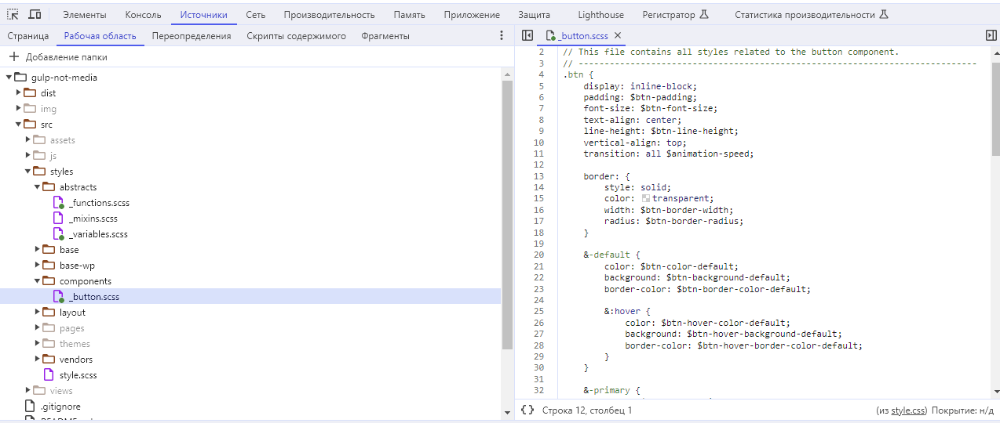

# Markup and Wordpres, PUG and HTML

# Начало разработки

Чтобы начать разработку, надо сделать клон в папку проекта используя команду

```
git clone git@github.com:Yura-Panchenko/Gulp-dev-new.git
```

### Перед началом работы над проектом необходимо сделать такие действия:

* определиться с видом проекта WP or Markup
* будете использовать PUG or HTML

Настройки проекта делаются в файле gulp-settings.js

## По умолчанию установлены настройки так что сборка компилит код для стандартного маркап проекта.


По умолчанию установлен препроцессор PUG.


## Настройка сборки под WP

* Меняем значение < isWP: false > на < isWP: true >

    

* Прописываем правильное название темы в файле gulp-settings.js

    

* В файле <style.scss> разкоменчиваем строки
    + // @import 'base-wp/head-wp';
    + // @import 'base-wp/cms-reset';
    + // @import 'base-wp/wp-reset';

### Чтобы коментарии сохранялись в финальном коде, ставим восклицательный знак вначале коментария

```
/*!
    block comments
*/
```

## Преходим внутрь папки где лежат gulp файлы

## Устанавливаем сборщик

для запуска нашего проекта надо установить наши модули

```
$ npm install
```
## Запускаем проект в разработку

Для старта нашего проекта запускаем команду - $ gulp

```
$ gulp
```

## Продолжение проекта

для последующей работы мы запускаем только команду

```
$ gulp
```

## Перед постановкой на QA или перед отправкой клиенту нам надо почистить код и ужать картинки, для этого запускаем команду

```
$ gulp dist
```

## Как работать с папками и файлами?

* Всю разработку проводим в папке src !!!
* в папку assets вкладываем (все то что не требует компиляции)
    - картинки
    - шрифты
* в папку js складываем js
* в папку views складываем pug or html в зависимости от того на чем идет разработка:
    - темплейты
    - mixins
    - head
    - header
    - footer
    - и тд
* в папку styles соответственно scss
* файлы которые не учавствуют в разработке - удаляем

## Рекомендації 
- Домовились використовувати 4 відступи в коді. Таби або спейси на розсуд розробника
- Найменування класів blockType-blockName (section-cards, card-user)
#### По імагам
- bg-01
- img-01
- img-01-d-2x (для ретины)
- alt в імагі на розсуд розробника повинен бути заповненим
- обо’язков писати width height атрибути для img

## Сніпети для медіазапросів без використання бібліотеки
- їх можете змінити під свої потреби
```
    "mph":{
        "prefix": "mph",
        "scope": "css, scss, less",
        "body": [
            "@media (max-width: #{\\$phone - 1}) {$1}"
        ],
        "description": "@media (max-width: 575px)"
    },
    "mphm":{
        "prefix": "mphm",
        "scope": "css, scss, less",
        "body": [
            "@media (min-width: #{\\$phone}) {$1}"
        ],
        "description": "@media (min-width: 576px)"
    },
    "mmob":{
        "prefix": "mmob",
        "scope": "css, scss, less",
        "body": [
            "@media (max-width: #{\\$tablet - 1}) {$1}"
        ],
        "description": "@media (max-width: 767px)"
    },
    "mmobm":{
        "prefix": "mmobm",
        "scope": "css, scss, less",
        "body": [
            "@media (min-width: #{\\$tablet}) {$1}"
        ],
        "description": "@media (min-width: 768px)"
    },
    "mdes":{
        "prefix": "mdes",
        "scope": "css, scss, less",
        "body": [
            "@media (max-width: #{\\$desktop - 1}) {$1}"
        ],
        "description": "@media (max-width: 991px)"
    },
    "mdesm":{
        "prefix": "mdesm",
        "scope": "css, scss, less",
        "body": [
            "@media (min-width: #{$desktop}) {$1}"
        ],
        "description": "@media (min-width: 992px)"
    },
    "mwid":{
        "prefix": "mwid",
        "scope": "css, scss, less",
        "body": [
            "@media (max-width: #{\\$widescreen - 1}) {$1}"
        ],
        "description": "@media (max-width: 1199px)"
    },
    "mwidm":{
        "prefix": "mwidm",
        "scope": "css, scss, less",
        "body": [
            "@media (min-width: #{\\$widescreen}) {$1}"
        ],
        "description": "@media (min-width: 1200px)"
    },
    "mxl":{
        "prefix": "mxl",
        "scope": "css, scss, less",
        "body": [
            "@media (max-width: #{\\$xl - 1}) {$1}"
        ],
        "description": "@media (max-width: 1599px)"
    },
    "mxlm":{
        "prefix": "mxlm",
        "scope": "css, scss, less",
        "body": [
            "@media (min-width: #{\\$xl}) {$1}"
        ],
        "description": "@media (min-width: 1600px)"
    },
```
### Універсальний сніпет
```
    "media diapazon": { 
        "scope": "scss,css", 
        "prefix": "qqq", 
        "body": [ 
            "@media (${1|min-width,max-width|}: ${2|#{$phone - 1},#{$phone},#{$tablet - 1},#{$tablet},#{$desktop - 1},#{$desktop},#{$widescreen - 1},#{$widescreen},#{$xl - 1},#{$xl}|}) {$3}" 
        ], 
        "description": "media diapazon" 
    },
```
Якщо вам потрібно зробити діапазон в якому повинні працювати стилі, то використовуєте вкладені медіазапроси


# Як зробити так, щоб стилі які ви змінюєте в інспекторі коду в браузері (Chrome), зберігалися в файлах проекту.
- відкрити DevTools, знайти вкладку "источники", потім нажати "добавление папки" 
- вибираємо проект який ми хочемо відслідковувати і жмемо кнопку "Разрешить" 
- ваш проект з'являється в списку, і ви зним можете вже працювати 

## Якщо вам потрібно видалити проект із робочої області:
- клікаємо правою кнопкою миші по потрібному вам проєкту і вибираємо "Удалить из рабочей области" 